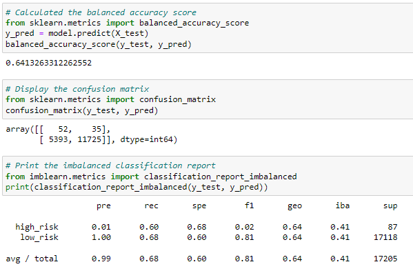
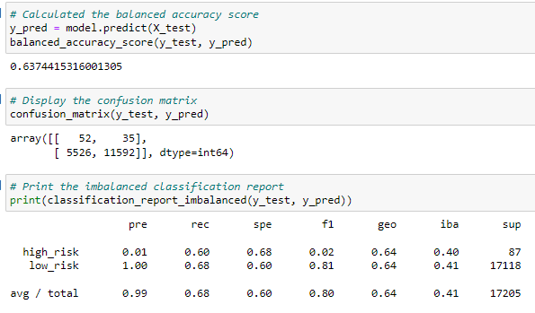
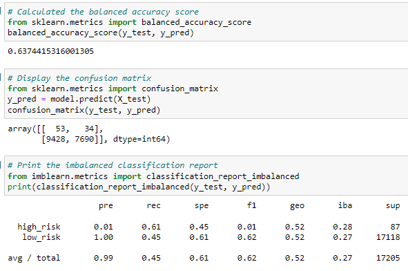
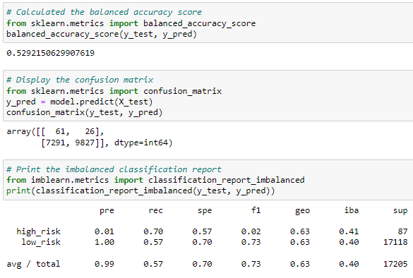
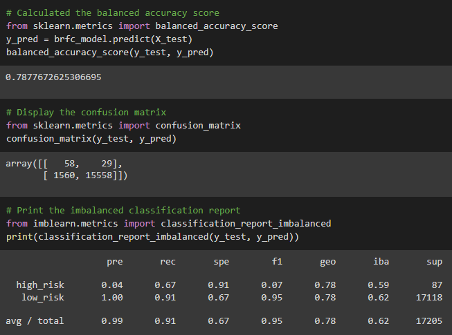
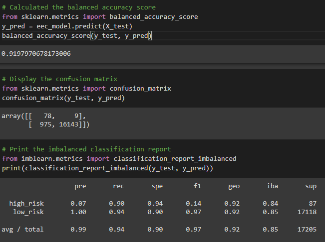

# Credit Risk Analysis

## Overview 
In recent years, obtaining personal loans has become one of the most popular and accessible options for millions of Americans to finance their lifestyles. Personal lending is growing faster than any other type of debt, whether it be credit card, auto, mortgage, or student debt. While it is such a growing finance trend that finance and banking institutions are providing to the public, it is key for them to understand the metrics and trends to optimize their lending practices. Or provide any insight for red flags of credit risk or fraud. 

In our analysis, we have a credit card dataset from LendingClub, a peer-to-peer lending services company, and through utilizing Python, we create and evaluate several machine learning models to predict credit risk. From the machine learning algorithms and our use of statistical reasoning, we will analyze the performance of the models and determine if there is the best one to focus on that will assist in predicting credit risk the most accurately. 

## Tools Used:
- Jupyter Notebook
- Python
- Google Colab

## Dataset:
- LoanStats_2019Q1.csv

## Objectives:
- Create training and test groups from a given data set.
- Implement the logistic regression, decision tree, random forest, and support vector machine algorithms.
- Interpret the results of the logistic regression, decision tree, random forest, and support vector machine algorithms.
- Compare the advantages and disadvantages of each supervised learning algorithm.
- Determine which supervised learning algorithm is best used for a given data set or scenario.
- Use ensemble and resampling techniques to improve model performance.

## Results
After applying the ETL process and splitting the data provided into training and test groups, we have a total of six algorithms and models to evaluate which one can bring us the most accurate responses to identifying an accurate credit risk. Here we have evaluated each model based on their respective balanced accuracy, precision, and recall scores. 

### Oversampling
**Naive Random Oversampling**

- Balance Accuracy Score: 0.64132
- Precision Score (High/Low): 0.01/ 1.00
- Recall Score (High/Low): 0.60/ 0.68

**SMOTE Oversampling**

- Balance Accuracy Score: 0.63744
- Precision Score (High/Low): 0.01/ 1.00
- Recall Score (High/Low): 0.60/ 0.68

### Undersampling
**Cluster Centroids**

- Balance Accuracy Score: 0.63744
- Precision Score (High/Low): 0.01/ 1.00
- Recall Score (High/Low): 0.61/ 0.45

**Combination (Over and Under) Sampling (SMOTEENN)**

- Balance Accuracy Score: 0.52921
- Precision Score (High/Low): 0.01/ 1.00
- Recall Score (High/Low): 0.70/ 0.57

### Ensemble Learners
**Balanced Random Forest Classifier**

- Balance Accuracy Score: 0.78776
- Precision Score (High/Low): 0.04/ 1.00
- Recall Score (High/Low): 0.67/0.91 

**Easy Ensemble Classifier**

- Balance Accuracy Score: 0.91979
- Precision Score (High/Low): 0.07/ 1.00
- Recall Score (High/Low): 0.90/ 0.94

## Summary
After having running all of the models, we can note that a common theme occurring is that they all detail weak scores. A low precision score is indicative of false positives, and in our analysis, signifies that that the models are essentially weak in determining if the present credit risk is high. When we take a look at the accuracy score, it also is not the best in the oversampling and undersampling models used for the datasets. Likewise, the low recall scores across the board demonstrates the large number of false negatives, those that are predicted to be low credit risk when they are in actuality high credit risk. When it came time to utilize the ensemble learner methods, they ultimately generated the best scores out of any model. With the best model being the Easy Ensemble Classifier, while we still had a weak prevision score for determining high-risk credit, both the accuracy and recall scores showed the most promise in this model compared to any of the other five models generated. 

From the results generated, it would be in the best interest to use different models and not rely on the ones selected for this analysis. The classification reports provide no confidence that any of the models would be best at representing and capturing where credit risk lies. Nearly all of the models have low accuracy’s and frankly the prevision and recall scores are not good to support the cause that these models will be good at classifying high/low credit risks.  With the weak scores generated, we run the risk of not capturing credit risk accurately where it is present or misreading the data altogether. 
